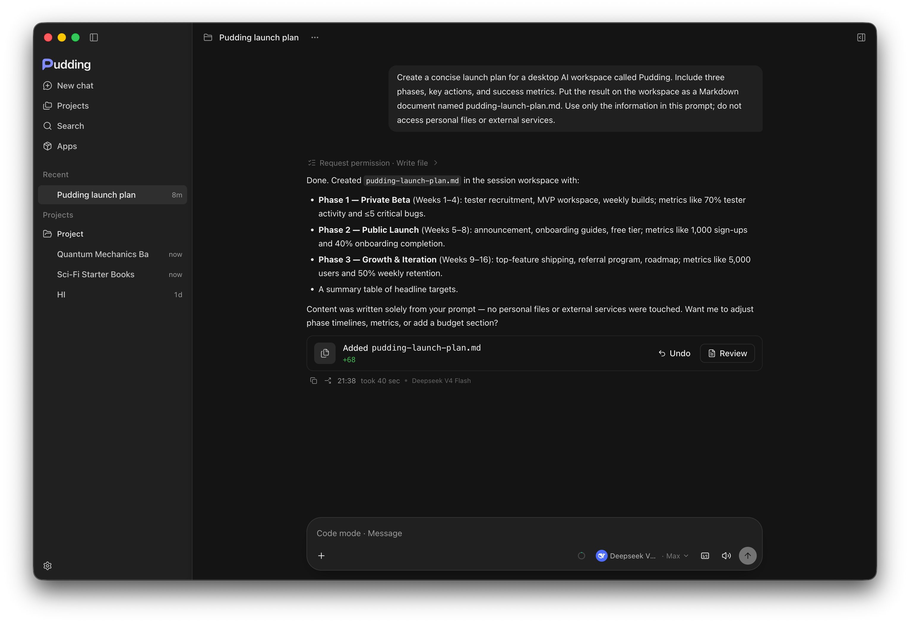
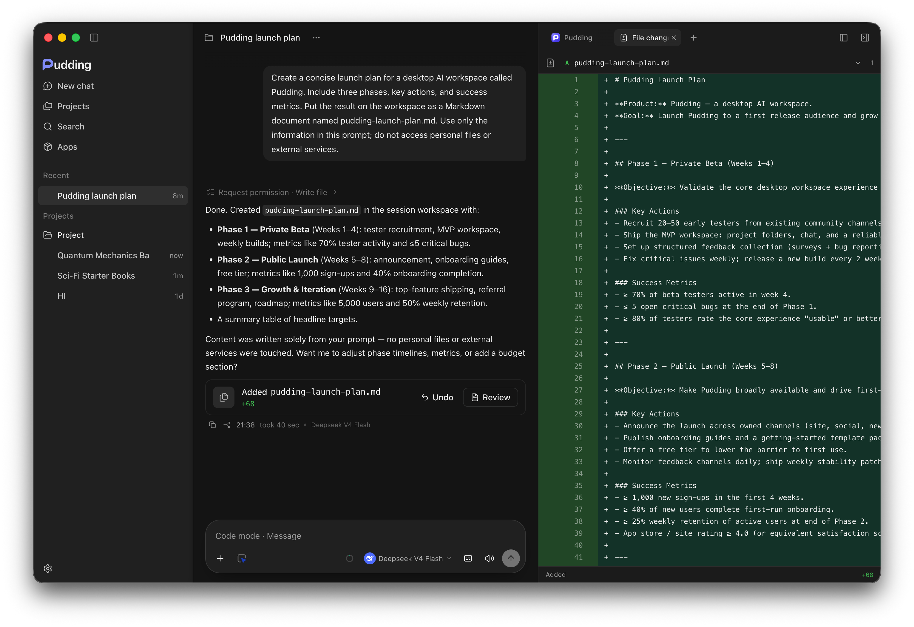
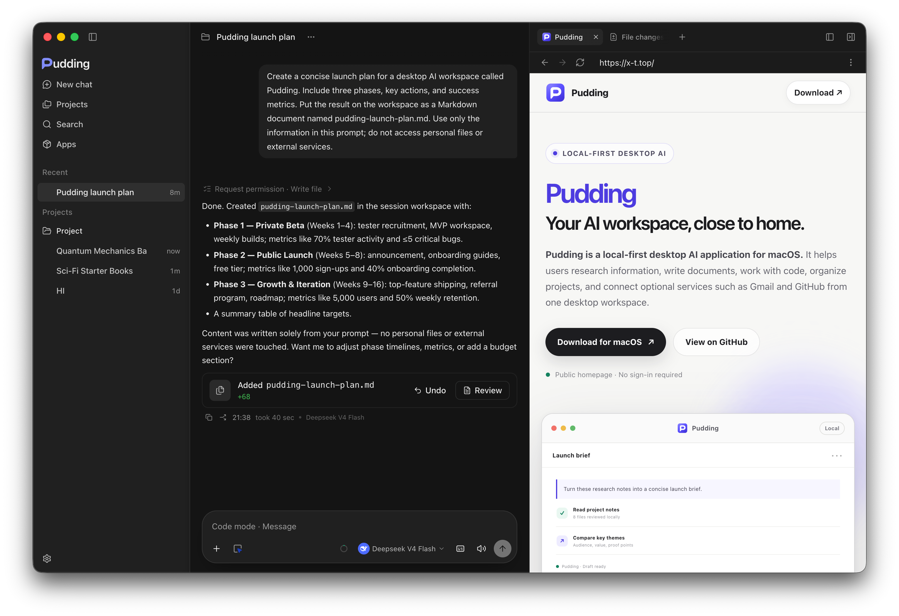
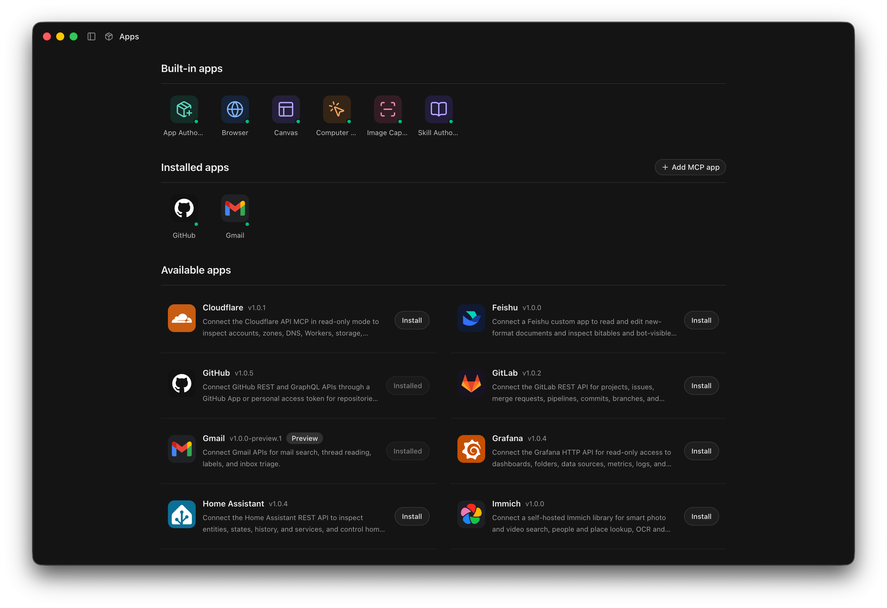

# Pudding

  <strong>Open-source AI workspace for macOS.</strong> 
  Run independent AI sessions, work with local projects, and keep useful results beside the conversation.

  <a href="https://github.com/teatak/pudding/releases/latest"><strong>Download for macOS</strong></a>
  · <a href="https://x-t.top">Website</a>
  · <a href="https://github.com/teatak/pudding-core">Source</a>
  · <a href="./README.zh-CN.md">中文</a>

macOS · Apple silicon and Intel · Early preview

> **Early preview:** this repository distributes Pudding releases, product information, and public catalog data.
> The AGPL-licensed application source is published in [`teatak/pudding-core`](https://github.com/teatak/pudding-core).

## Features

### Independent sessions

Each chat is a separate workspace with its own conversation, project, tools, permissions, and live activity. Keep
several tasks moving without one task silently becoming another task's context.

- Create standalone chats or group them under projects.
- Search previous sessions and archive work you no longer need in the sidebar.
- Branch from an existing answer when you want to explore a different direction.
- Choose the model and reasoning level for each task.

### AI work with visible results

Pudding can use tools, edit files, and keep the result visible beside the conversation. Tool activity is shown in
the transcript, permission requests stay explicit, and file changes can be reviewed before you continue.

The workspace can hold file previews, diffs, browser pages, documents, tables, images, and reusable widgets. Useful
work does not have to disappear into a long chat transcript.

### Built-in browser and desktop tools

Open a browser beside the chat so research and follow-up work stay in the same session. Pudding can also work with
local terminal tools, capture images, use computer controls, and operate on project files after you grant access.

- Keep multiple workspace resources open as tabs.
- Add browser pages and captured results without leaving the task.
- Review local file changes in a dedicated diff view.
- Cancel long-running model turns when the task changes.

### Local projects

Attach a folder only when a task needs it. Project files remain in the directory you choose, while each session
keeps its own conversation and tool activity. Pudding asks for capability and directory access instead of assuming
that every chat can read your computer.

### Apps, skills, and MCP

Built-in apps provide the browser, canvas, computer use, image capture, and authoring tools. Install optional apps
for services such as GitHub and Gmail, connect MCP servers, or create reusable skills for repeatable workflows.

- **Apps** package reusable integrations, including REST, GraphQL, and MCP tools.
- **Skills** provide task-specific instructions and repeatable workflows.
- **Widgets** are interactive workspace results that can be saved as favorites and reused.

### Bring your own model

Connect OpenAI, Anthropic, Google Gemini, DeepSeek, Qwen, Xiaomi MiMo, Moonshot/Kimi, Zhipu GLM, OpenRouter,
Ollama, or a custom compatible endpoint. Model requests go to the provider you configure; Pudding does not claim
that cloud models run locally.

### Voice when you want it

Pudding supports dictation, voice dialogue, and speech playback. Voice assets are optional downloads stored under
`~/.pudding/runtime`, so the desktop installer does not need to bundle large speech models.

## Download and install

The current preview supports macOS on both Apple silicon and Intel.

| Mac | Download |
| --- | --- |
| Apple silicon | `Pudding-<version>-arm64.dmg` |
| Intel | `Pudding-<version>-x64.dmg` |

1. Download the right DMG from [the latest release](https://github.com/teatak/pudding/releases/latest).
2. Open it and drag **Pudding.app** into **Applications**.
3. Launch Pudding.

Preview builds are signed with a Developer ID certificate and notarized by Apple. On first launch, macOS may ask
you to confirm that you want to open an application downloaded from the internet.

## Your data, with clear boundaries

- Pudding does not require a Pudding account.
- Conversations, settings, the local database, installed apps and skills, and optional runtime assets live under
  `~/.pudding`.
- Project files stay in the folders you choose.
- Model requests go only to the provider you configure.
- Public starter catalogs are cached locally, and Pudding does not upload catalog interaction data.

## Repository contents

This repository is the public distribution hub for Pudding:

- Application source and development live in [`teatak/pudding-core`](https://github.com/teatak/pudding-core).
- Desktop releases use `v<version>` tags.
- Voice runtime assets use `runtime-v<version>` tags.
- [`catalog/starter-prompts.json`](./catalog/starter-prompts.json) contains clickable prompts submitted only after
  the user chooses one.
- [`catalog/user-messages.json`](./catalog/user-messages.json) contains localized, display-only new-session copy and
  an optional external link. It is never inserted into the composer or sent to a model. Raw HTML is not supported.

Signed preview builds can download updates in the background. Installation starts only after the user chooses
**Restart to Update**, and the latest DMG remains available for manual installation or rollback.

---

  <a href="https://github.com/teatak/pudding/releases/latest"><strong>Download Pudding</strong></a>
  · <a href="https://x-t.top">x-t.top</a>

