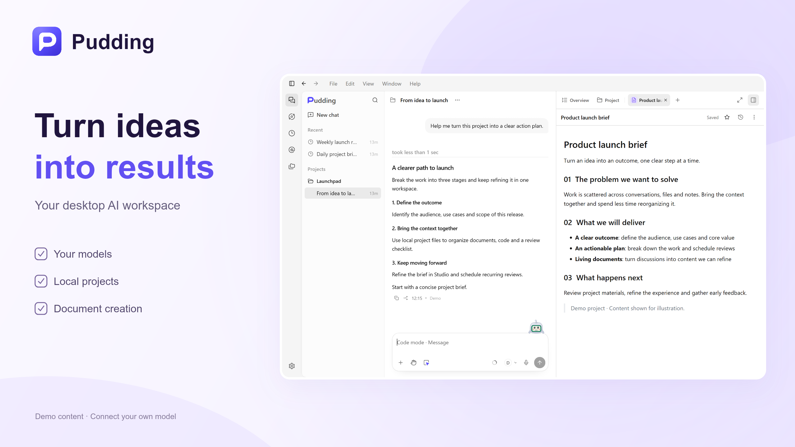
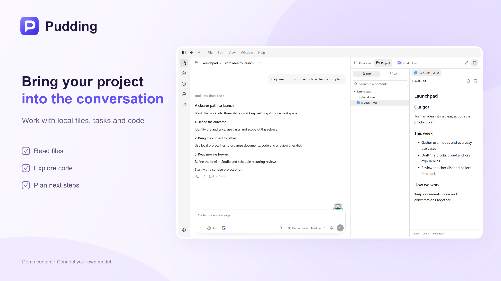
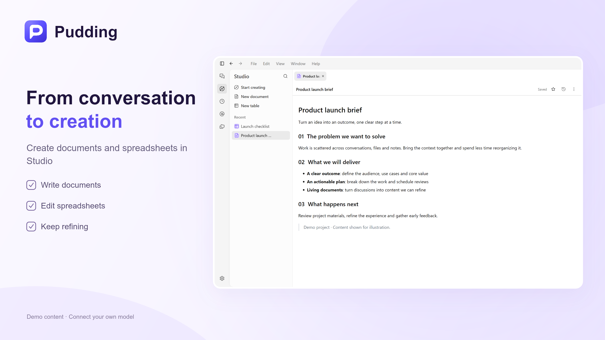
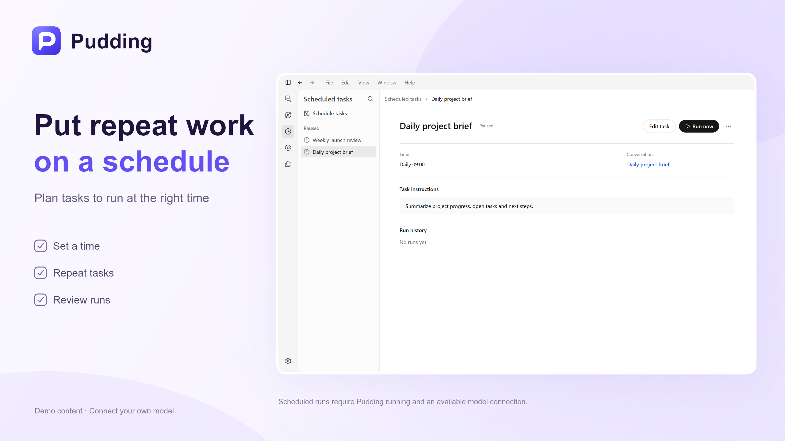

# Pudding

  <strong>Your AI workspace for macOS and Windows.</strong> 
  Connect your preferred models. Work with conversations, local projects, documents, and scheduled tasks in one place.

  <a href="https://apps.microsoft.com/detail/9P0T8NV49C51"><strong>Get it for Windows</strong></a>
  · <a href="#download-and-install"><strong>Download for macOS</strong></a>
  · <a href="https://teatak.com/products/pudding/">Website</a>
  · <a href="https://github.com/teatak/pudding-core">Core source</a>
  · <a href="./README.zh-CN.md">中文</a>

Free for personal and commercial use · macOS Apple silicon / Intel · Windows x64 / ARM64

*Images show the Windows 0.5.0 candidate with demo content. The version available in Microsoft Store may differ while certification is in progress.*

## Download and install

| Platform | Requirements | Download |
| --- | --- | --- |
| Windows · x64 and ARM64 | Windows 10 build 19041 or later, including Windows 11 | [Microsoft Store](https://apps.microsoft.com/detail/9P0T8NV49C51) |
| macOS · Apple silicon | macOS 14.0 or later | [Download DMG](https://teatak.com/download/pudding/mac-arm64) |
| macOS · Intel | macOS 15.5 or later | [Download DMG](https://teatak.com/download/pudding/mac-x64) |

**Windows:** install from Microsoft Store, which selects the package for your device and handles updates. Windows
releases are distributed through the Store, not as installers on GitHub.

**macOS:** open the DMG and drag **Pudding.app** into **Applications**. Official builds are signed and notarized by
Apple. Pudding checks for updates in the background; you can also download the latest DMG from the links above.

After installation, configure a model provider or connect a local model. Pudding itself is free; third-party
model usage may be billed separately by your provider. No Pudding account is required.

## What you can do

### Choose your models

Built-in presets include OpenAI, Anthropic, Google Gemini, DeepSeek, Qwen, Xiaomi MiMo, Moonshot Kimi, Zhipu GLM,
OpenRouter, Buzz, and Ollama, with support for compatible endpoints.

- Choose a model and reasoning effort for each task.
- Run local models through Ollama, or connect a team gateway through [Buzz](https://teatak.com/products/buzz/).
- Keep several conversations running independently, each with its own model, tools, and permissions.
- Pin, search, and archive sessions, or branch from an answer to explore another direction.

### Work with local projects

Bring a project folder into a conversation. Files stay in their original location, while previews, diffs, browser
pages, and Studio items open alongside your chat.

- Read, search, and edit files; review changes in a diff view.
- Run commands, find definitions and references, and inspect Go and TypeScript diagnostics.
- Set project approvals to Ask, Auto, or Full access. Stop a running turn whenever needed.

### Create in Studio

Turn a conversation into documents, tables, and interactive widgets you can keep refining.

- Create Markdown documents and typed tables with autosave and version history.
- Select text, cells, or columns and send them to a conversation for revision.
- Compare changes and restore a previous version.
- Build widgets from editable React source; import/export CSV and export Markdown.

### Schedule work and delegate tasks

- Schedule daily or weekly tasks in an existing conversation and review their run history.
- Let a main conversation delegate subtasks, track progress, and combine results.
- Receive a system notification when a task finishes or needs your approval.

Scheduled tasks require Pudding to be running and the configured model connection to be available.

### Browse, extend, and dictate

- Use the built-in browser to open pages, click, type, capture screenshots, and read content beside the conversation.
- Add plugins for services such as GitHub and Gmail, connect MCP servers, and turn routines into reusable skills.
- Dictate messages with local speech recognition; voice assets are an optional download.
- On **macOS**, computer use can view and operate native apps with your permission. **Windows does not currently
  include native computer use**; the built-in browser remains available.

## Data and privacy

- Conversations, settings, the local database, plugins, skills, and optional runtime assets are stored locally in
  the `.pudding` folder in your home directory. Project files stay in the folders you choose.
- Model requests go to the providers you configure. Local storage does not make a cloud model request offline.
- Approval settings control tool access; temporary permissions can be reviewed and revoked.
- Public starter catalogs are cached locally; Pudding does not upload catalog interaction data.

Read the [privacy policy](https://teatak.com/privacy).

## Open-source core and this repository

Pudding's local Agent backend is open source under Apache-2.0 in
[`teatak/pudding-core`](https://github.com/teatak/pudding-core). The desktop UI, Electron shell, native helpers, and
packaging are maintained in the private `pudding-desktop` repository. Since 0.3.5, Pudding Desktop uses a
proprietary license that permits free personal and commercial use; earlier builds retain their original licenses.

This repository is the public distribution hub:

- [Releases](https://github.com/teatak/pudding/releases) — macOS downloads and optional runtime assets.
- [`releases/`](./releases) — version manifests and build provenance, including separate [Windows Store records](./releases/windows-store).
- [Reusable product images](./assets/readme/README.md) — bilingual images, usage and source links. Originals live in the versioned [`assets/store/`](./assets/store) archive.
- [`catalog/`](./catalog) — starter prompts and display-only new-session messages. Prompts are submitted only when selected;
  display-only messages are never sent to a model.
- [Artifact management](./docs/artifact-management.md) — ownership, archival, and website reference conventions.

---

  <a href="https://apps.microsoft.com/detail/9P0T8NV49C51"><strong>Windows · Microsoft Store</strong></a>
  · <a href="#download-and-install"><strong>macOS · Download</strong></a>
  · <a href="https://teatak.com/products/pudding/">teatak.com</a>

