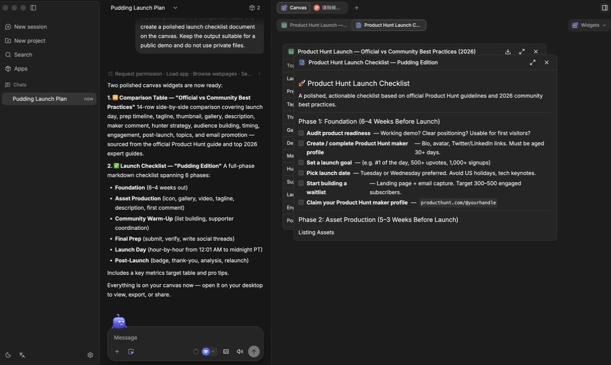

# 布丁

[](https://github.com/teatak/pudding/releases/latest)

**在独立 AI 会话中完成网页研究、终端任务，并把有价值的结果留在共享画布上。** 每个会话保留自己的上下文；
你可以接入自己的模型服务，工作区数据则保存在 Mac 本机。

[**下载 macOS 版本 →**](https://github.com/teatak/pudding/releases/latest) ·
[查看真实工作流](#一个工作流一个工作区) · [English](./README.md)

> 布丁目前处于早期预览阶段。这个公开仓库用于提供产品说明、发布包和初始目录，源码暂未公开。

## 一个工作流，一个工作区

让布丁使用内置浏览器研究主题，在需要时执行终端任务，再把有用结果整理成文档、表格、图片或小组件放到画布上。
这些成果会持续显示在对话旁边，不再散落于其他标签页或被埋进聊天记录。



## 主要能力

- **多会话工作区**：同时保留多个独立会话及其项目上下文。
- **共享画布**：持续保留文档、表格、图片、小组件和浏览器页面等结果。
- **可见的工具过程**：在画布中使用浏览器、终端、相机、桌面截取和已安装应用。
- **可扩展工作流**：通过小组件、技能、MCP 工具和应用集成扩展特定任务。
- **灵活的模型接入**：支持 OpenAI、Anthropic、Gemini、DeepSeek、Qwen、MiMo、Moonshot/Kimi、智谱 GLM、
  OpenRouter、Ollama 以及自定义兼容接口。
- **可选语音能力**：安装对应运行资源后，可使用听写、语音对话和原音播放。

## 安装

当前预览版本支持 Apple 芯片和 Intel 芯片的 macOS。

1. 从 [Releases](https://github.com/teatak/pudding/releases/latest) 下载适合你的 DMG：
   - Apple 芯片：`Pudding-<version>-arm64.dmg`
   - Intel 芯片：`Pudding-<version>-x64.dmg`
2. 打开 DMG，将 `Pudding.app` 拖入“应用程序”。
3. 打开布丁。

### macOS 首次打开

当前预览包使用 Developer ID 证书签名并已通过 Apple 公证。首次启动时，macOS 可能会确认是否打开从互联网下载的应用，点击“打开”即可。

## 本地数据

布丁将应用状态、配置、本地数据库、已安装的应用与技能，以及可选运行资源保存在：

```text
~/.pudding
```

项目文件仍保存在你选择的目录中；布丁不再默认使用固定的 `~/pudding` 工作目录。模型请求会发送到你选择的
模型服务，模型凭据和模型配置均在布丁内管理。

## 语音运行资源

语音功能使用保存在 `~/.pudding/runtime` 下的可选运行资源。布丁会在安装前提示，因此桌面安装包无需默认
携带体积较大的语音模型。语音资源通过独立的 `runtime-v1` Release 发布。

## 应用、小组件与技能

- **应用**封装可复用的集成，包括 REST、GraphQL 和 MCP 工具。
- **小组件**是画布中的交互式结果，可以收藏并在不同会话中复用。
- **技能**提供可跨会话复用的任务说明和工作流程。

## 新会话内容

- [`catalog/starter-prompts.json`](./catalog/starter-prompts.json) 保存可点击的快捷提示词，用户选择后才会提交给当前模型。
- [`catalog/user-messages.json`](./catalog/user-messages.json) 保存新会话页的多语言主标题、可选副标题和外部链接。内容只在界面中展示，绝不会写入输入框或发送给模型，也不支持注入原始 HTML。

布丁会定期读取这两个公开目录并缓存在本机，不上传用户行为。

## 发布与更新

- 桌面应用使用 `v<版本号>` 标签。
- 运行资源使用 `runtime-v<版本号>` 标签。
- 已签名的预览版本可以在后台下载更新，只有用户点击“重新启动以更新”后才会安装；最新版 DMG 仍可作为手动更新兜底。

桌面应用和运行资源分开发布，避免每次应用更新都重复下载较大的语音资源。历史版本会继续保留，方便必要时回退。

## 源码与分发

这个仓库包含公开产品说明、发布元数据、安装包和目录数据。Pudding 源码未在这个仓库中公开。
