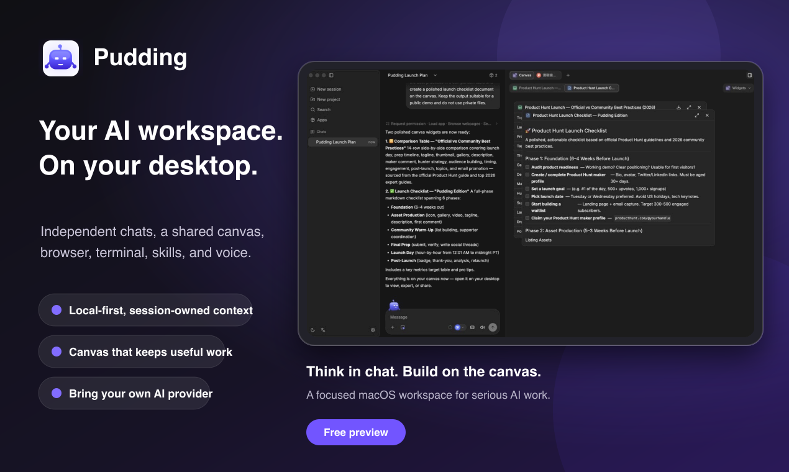
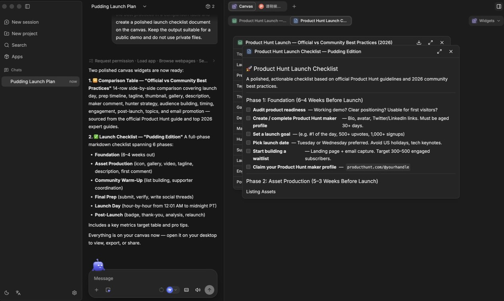
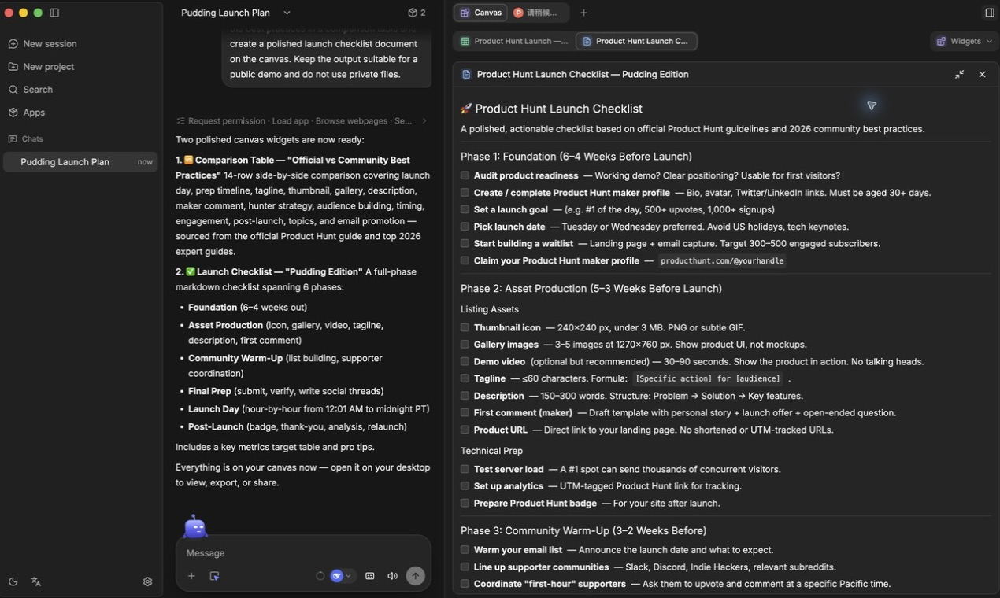
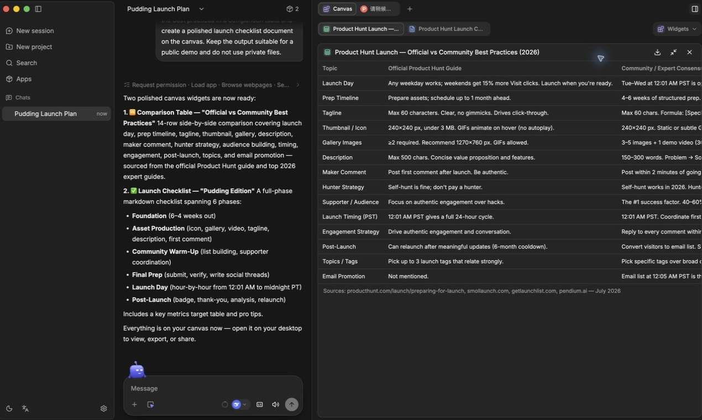

# Pudding

  <strong>桌面上的 AI 工作区。</strong> 
  独立会话、共享画布、浏览器与终端工具，以及由你选择的模型。

  <a href="https://github.com/teatak/pudding/releases/latest"><strong>下载 macOS 版本</strong></a>
  · <a href="https://x-t.top">官网</a>
  · <a href="./README.md">English</a>

macOS · Apple 芯片与 Intel · 早期预览

> **早期预览：**这个公开仓库用于分发 Pudding 安装包、产品资料和公开目录数据，应用源码未在这里发布。

## AI 工作不该只留下一段聊天记录

聊天适合思考，但真正的工作很快会散落到浏览器标签、终端窗口、文件和长篇对话中。Pudding 把对话、工具和结果
放在同一个桌面工作区里。

| 1. 研究 | 2. 执行 | 3. 留下结果 |
| --- | --- | --- |
| 在浏览网页时持续保留任务上下文。 | 使用本地终端、项目目录和已连接的应用。 | 把有价值的输出整理成文档、表格、图片或可复用小组件，留在画布上。 |

每个会话拥有自己的上下文，因此一个任务不会悄悄变成另一个任务的记忆。

<table>
  <tr>
    <td width="50%">
      
       <strong>从资料研究到可执行文档</strong>
    </td>
    <td width="50%">
      
       <strong>从分散来源到结构化对比</strong>
    </td>
  </tr>
</table>

## Pudding 提供什么

- **独立 AI 会话**：分别管理对话、项目、工具和上下文。
- **对话旁的画布**：持续展示文档、表格、图片、浏览器页面和交互式小组件。
- **桌面工具**：使用内置浏览器、终端、图像采集、语音和已安装应用。
- **本地项目**：让会话在你明确选择的目录中工作。
- **自选模型**：根据任务连接适合的模型服务和模型。
- **可扩展工作流**：通过应用、小组件、技能和 MCP 工具扩展能力。

## 下载与安装

当前预览版本同时支持 Apple 芯片和 Intel 芯片的 macOS。

| Mac | 安装包 |
| --- | --- |
| Apple 芯片 | `Pudding-<版本>-arm64.dmg` |
| Intel | `Pudding-<版本>-x64.dmg` |

1. 从[最新 Release](https://github.com/teatak/pudding/releases/latest)下载对应的 DMG。
2. 打开安装包，将 **Pudding.app** 拖入“应用程序”。
3. 启动 Pudding。

预览版本使用 Developer ID 证书签名，并已通过 Apple 公证。首次打开时，macOS 可能会确认是否运行从互联网下载的应用。

## Local-first，以及清晰的数据边界

- Pudding 不要求注册 Pudding 账号。
- 对话、设置、本地数据库、已安装应用与技能，以及可选运行资源保存在 `~/.pudding`。
- 项目文件仍留在你选择的目录中。
- 模型请求会发送到你配置的模型服务；Pudding 不会把云端模型包装成本地模型。
- 公开的初始目录会缓存在本机，Pudding 不上传目录交互数据。

## 模型与扩展

  
<strong>模型服务</strong>

Pudding 可连接 OpenAI、Anthropic、Google Gemini、DeepSeek、Qwen、小米 MiMo、Moonshot/Kimi、智谱 GLM、
OpenRouter、Ollama 以及自定义兼容接口。

- **应用**封装可复用的集成，包括 REST、GraphQL 和 MCP 工具。
- **小组件**是可收藏并复用的画布交互结果。
- **技能**提供面向特定任务的说明与可重复工作流。

## 可选语音资源

听写、语音对话和语音播放使用保存在 `~/.pudding/runtime` 下的可选资源。Pudding 会在安装前提示，因此桌面安装包
无需默认携带体积较大的语音模型。语音资源通过独立的 `runtime-v1` Release 发布。

## 仓库内容

这个仓库是 Pudding 的公开分发中心：

- 桌面版本使用 `v<版本>` 标签。
- 语音运行资源使用 `runtime-v<版本>` 标签。
- [`catalog/starter-prompts.json`](./catalog/starter-prompts.json) 保存快捷提示词，只有用户选择后才会提交给模型。
- [`catalog/user-messages.json`](./catalog/user-messages.json) 保存新会话页的多语言展示文案和可选外部链接；内容不会
  写入输入框或发送给模型，也不支持原始 HTML。

已签名的预览版本可以在后台下载更新，只有用户选择“重新启动以更新”后才会安装。最新版 DMG 仍可用于手动安装或回退。

---

  <a href="https://github.com/teatak/pudding/releases/latest"><strong>下载 Pudding</strong></a>
  · <a href="https://x-t.top">x-t.top</a>

