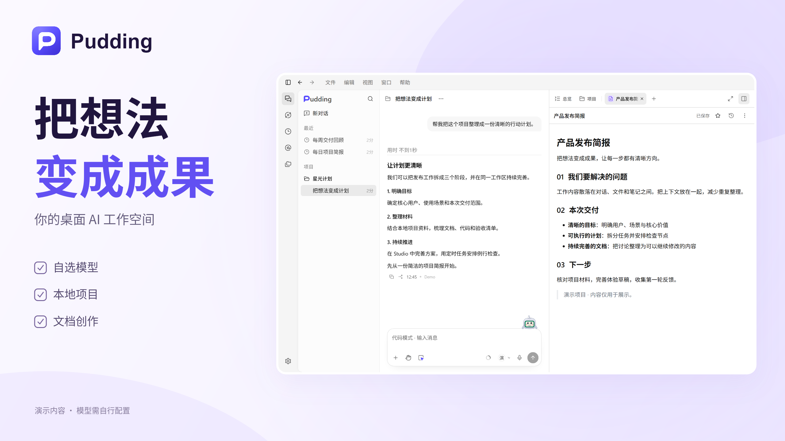
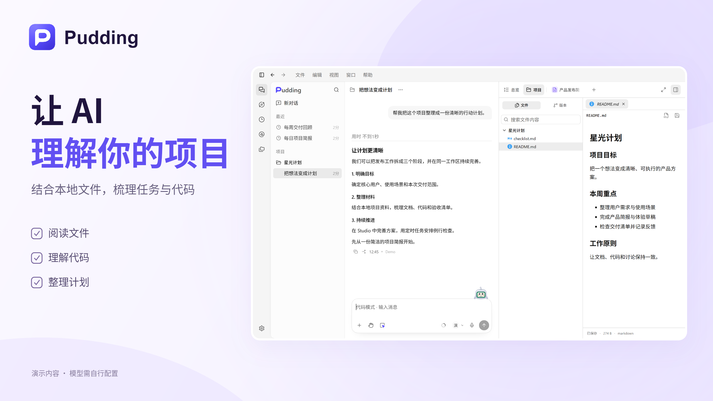
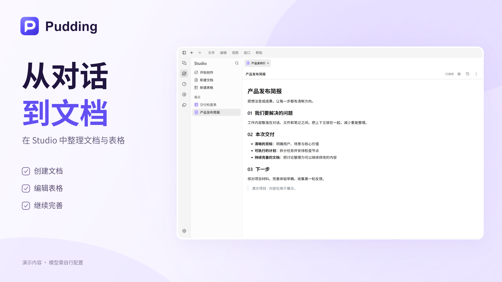
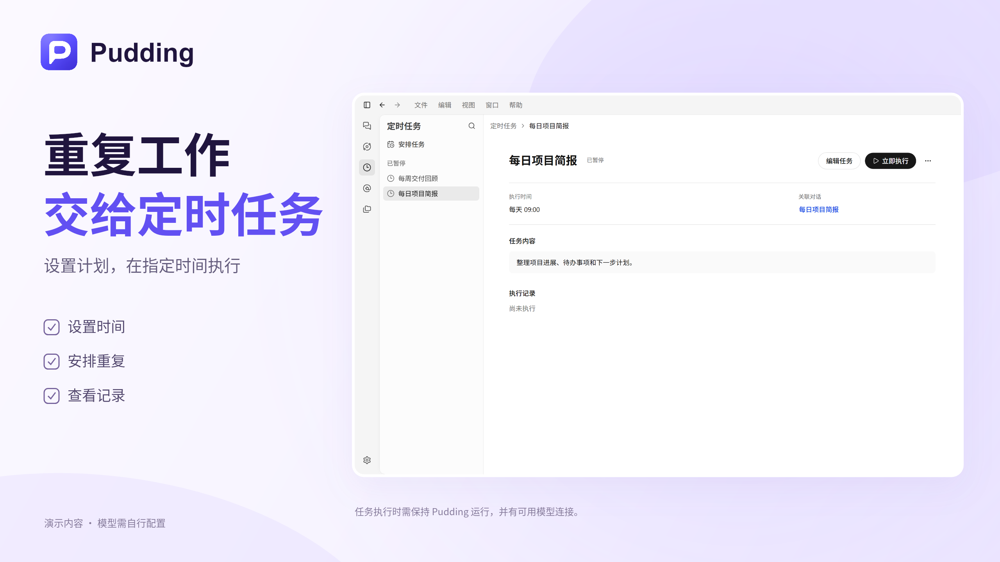

# Pudding

  <strong>适用于 macOS 和 Windows 的 AI 工作台。</strong> 
  连接自选模型，在同一个工作区管理对话、本地项目、文档和定时任务。

  <a href="https://apps.microsoft.com/detail/9P0T8NV49C51"><strong>下载 Windows 版</strong></a>
  · <a href="#下载与安装"><strong>下载 macOS 版</strong></a>
  · <a href="https://teatak.com/products/pudding/">官网</a>
  · <a href="https://github.com/teatak/pudding-core">核心源码</a>
  · <a href="./README.md">English</a>

个人和商业用途均可免费使用 · macOS Apple 芯片 / Intel · Windows x64 / ARM64

*图片展示 Windows 0.5.0 候选版与演示内容；商店审核期间，Microsoft Store 实际提供的版本可能不同。*

## 下载与安装

| 平台 | 系统要求 | 下载 |
| --- | --- | --- |
| Windows · x64 和 ARM64 | Windows 10 build 19041 及以上，包括 Windows 11 | [Microsoft Store](https://apps.microsoft.com/detail/9P0T8NV49C51) |
| macOS · Apple 芯片 | macOS 14.0 及以上 | [下载 DMG](https://teatak.com/download/pudding/mac-arm64) |
| macOS · Intel | macOS 15.5 及以上 | [下载 DMG](https://teatak.com/download/pudding/mac-x64) |

**Windows：** 从 Microsoft Store 安装，商店会选择适合设备架构的程序包并负责更新。Windows 版通过商店分发，不在 GitHub 提供安装器。

**macOS：** 打开 DMG，将 **Pudding.app** 拖入“应用程序”。官方版本已签名并通过 Apple 公证。应用会在后台检查更新，也可使用上方链接下载最新 DMG。

安装后配置模型服务商，或连接本地模型即可开始使用。Pudding 本身免费，第三方模型调用可能由服务商单独计费。无需注册 Pudding 账号。

## 你可以做什么

### 自选模型，独立开展任务

内置 OpenAI、Anthropic、Google Gemini、DeepSeek、阿里通义千问、小米 MiMo、Moonshot Kimi、智谱 GLM、OpenRouter、Buzz 和 Ollama 预设，并支持兼容接口。

- 为每个任务选择模型与推理强度。
- 通过 Ollama 使用本地模型，或通过 [Buzz](https://teatak.com/products/buzz/) 接入团队模型网关。
- 多个会话可独立运行，各自拥有模型、工具与权限。
- 置顶、搜索、归档会话，或从某条回答分支出新对话。

### 结合本地项目工作

把项目文件夹关联到会话，文件仍留在原目录。预览、差异、网页和 Studio 内容以标签页形式与对话并排显示。

- 读写、搜索项目文件，在差异视图中审阅改动。
- 运行命令，查找定义和引用，查看 Go 和 TypeScript 诊断。
- 按项目选择请求批准、替我审批或完全访问；执行中的轮次可随时中断。

### 在 Studio 中创作

把对话整理成可持续修改的文档、表格和交互小组件。

- 创建 Markdown 文档和类型化表格，自动保存并保留版本历史。
- 选中文字、单元格或列，交给会话修改。
- 对比改动，恢复到此前版本。
- 基于可编辑的 React 源码制作小组件，导入导出 CSV、导出 Markdown。

### 安排定时任务与协作

- 按天或按周安排任务，在原会话中执行并查看运行记录。
- 由主会话派发子任务、跟踪进度并汇总结果。
- 任务完成或需要审批时接收系统通知。

定时任务执行需要 Pudding 保持运行，且已配置的模型连接可用。

### 浏览网页、扩展工具与语音输入

- 使用内置浏览器打开网页、点击、输入、截图和读取内容，与对话并排完成工作。
- 安装 GitHub、Gmail 等服务插件，连接 MCP 服务器，把常用流程保存为技能。
- 通过本地语音识别听写消息，语音资源按需下载。
- **macOS** 支持经授权后查看和操作本机应用的电脑操作能力。**Windows 暂不包含本机电脑操作**，但可使用内置浏览器。

## 数据与隐私

- 对话、设置、本地数据库、插件、技能和可选运行资源保存在用户目录下的 `.pudding` 文件夹；项目文件留在你选择的目录中。
- 模型请求发送到你配置的服务商。本地保存数据不意味着调用云端模型时无需联网。
- 通过审批设置控制工具访问，临时授权可查看和撤销。
- 公开的初始目录缓存在本机，Pudding 不上传目录交互数据。

查看[隐私政策](https://teatak.com/privacy)。

## 开源核心与本仓库

Pudding 的本地 Agent 后端以 Apache-2.0 许可开源，位于 [`teatak/pudding-core`](https://github.com/teatak/pudding-core)。桌面界面、Electron 外壳、原生辅助程序和打包工具在私有的 `pudding-desktop` 仓库维护。Pudding Desktop 从 0.3.5 起采用专有许可，允许个人和商业用途免费使用；此前版本保留原有许可证。

这个仓库是 Pudding 的公开分发中心：

- [Releases](https://github.com/teatak/pudding/releases)：macOS 下载与可选运行资源。
- [`releases/`](./releases)：版本清单与构建来源，包括独立的 [Windows Store 记录](./releases/windows-store)。
- [可复用产品图片](./assets/readme/README.md)：中英文图片、用途与来源链接，原图统一保存在版本化的 [`assets/store/`](./assets/store) 目录。
- [`catalog/`](./catalog)：快捷提示词和新会话展示文案；提示词仅在用户选择后提交，纯展示文案不会发送给模型。
- [发布产物管理约定](./docs/artifact-management.md)：产物归属、归档规则与官网引用方式。

---

  <a href="https://apps.microsoft.com/detail/9P0T8NV49C51"><strong>Windows · Microsoft Store</strong></a>
  · <a href="#下载与安装"><strong>macOS · 下载</strong></a>
  · <a href="https://teatak.com/products/pudding/">teatak.com</a>

