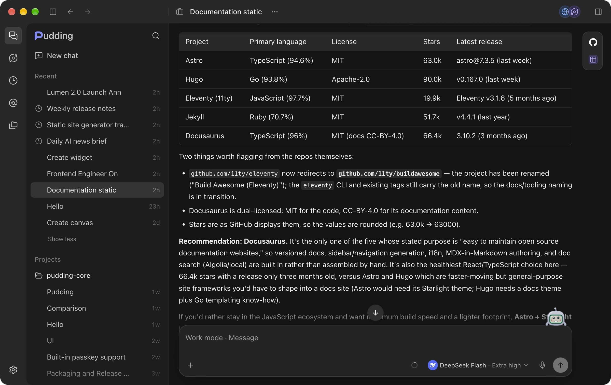
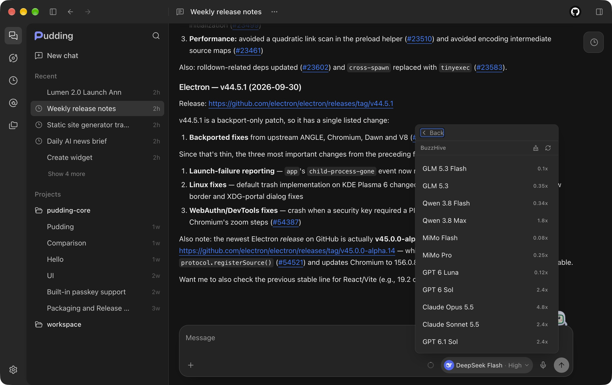
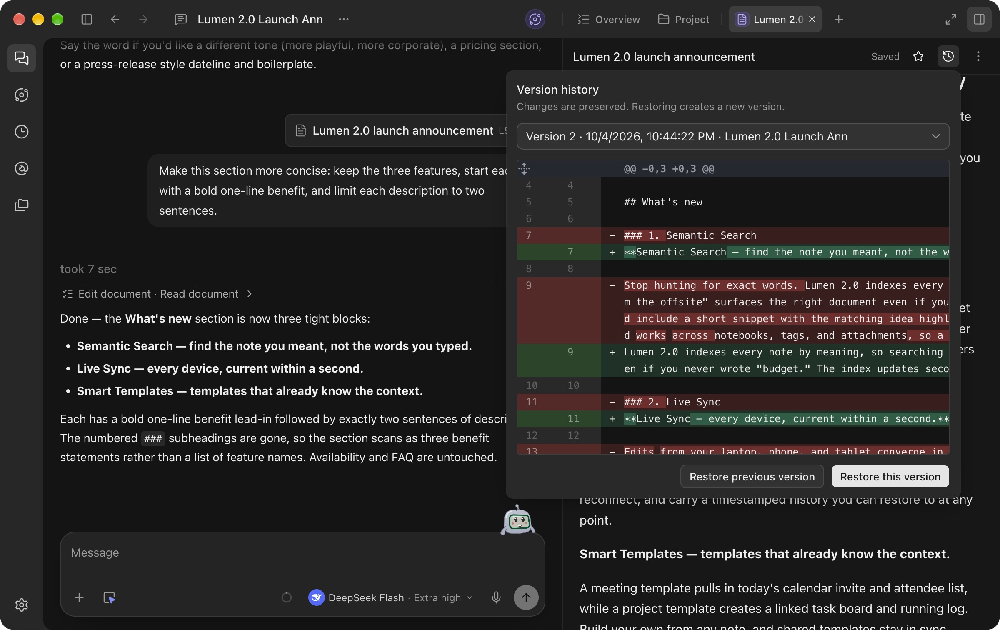
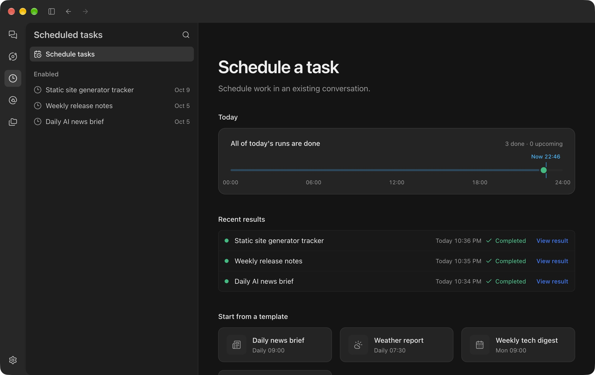
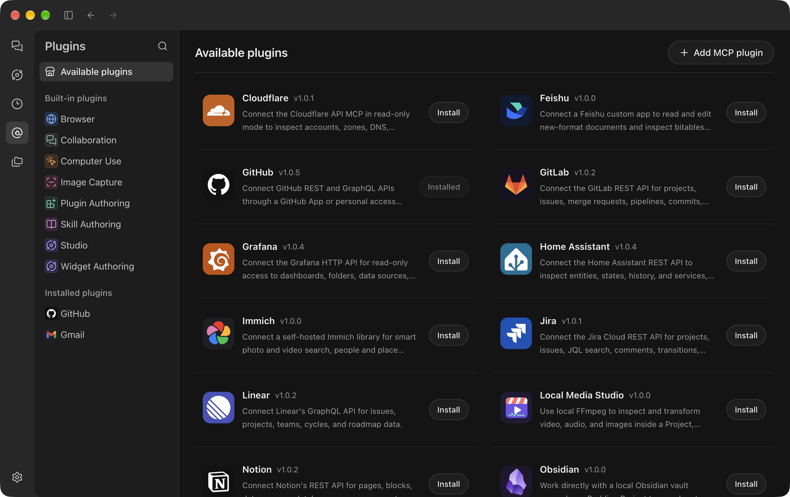

# Pudding

  <strong>连接主流大模型的桌面 AI 工作台。</strong> 
  独立会话、内置浏览器与工具、Studio 文档与表格、定时任务和插件，由开源核心驱动。

  <a href="https://github.com/teatak/pudding/releases/latest"><strong>下载</strong></a>
  · <a href="https://teatak.com/products/pudding/">官网</a>
  · <a href="https://github.com/teatak/pudding-core">核心源码</a>
  · <a href="./README.md">English</a>

个人和商业用途均可免费使用 · 目前提供 macOS 版（Apple 芯片与 Intel）

> 这个仓库用于分发 Pudding 安装包、产品资料和公开目录数据。本地 Agent 后端以 Apache-2.0 许可开源，位于 [`teatak/pudding-core`](https://github.com/teatak/pudding-core)。桌面界面、Electron 外壳、原生辅助程序和应用打包在私有的 `pudding-desktop` 仓库维护。Pudding Desktop 从 0.3.5 起采用专有许可，个人和商业用途均可免费使用；此前版本保留各自原有的许可证声明。

## 功能

### 主流大模型，开箱即用

内置 OpenAI、Anthropic、Google Gemini、DeepSeek、阿里通义千问、小米 MiMo、Moonshot Kimi、智谱 GLM、OpenRouter、Buzz 和 Ollama 的预设，并支持任意兼容接口。填写 API Key 即可使用。

- 为每个任务选择模型与推理强度。
- 通过 Ollama 使用本地模型，或通过 [Buzz](https://teatak.com/products/buzz/) 接入团队统一的模型网关。
- 模型请求只发送到你配置的服务商。

### 独立会话与项目

每个任务拥有独立的对话、模型、工具与权限，多个任务可同时进行。

- 从任一回答开始新聊天，在副本中探索不同方向。
- 按需关联项目文件夹，文件始终保留在原目录。
- 按项目设置审批方式：请求批准、替我审批或完全访问。
- 在侧栏置顶、搜索和归档会话。

### 工作区与工具

Pudding 为模型提供文件、命令和代码理解工具。文件预览、差异、网页、Studio 内容和图片以标签页的形式与对话并排显示。

- 读写和搜索项目文件，在差异视图中审阅每一处改动。
- 运行命令；执行中的轮次可随时中断，失败的轮次可重试。
- 查找定义和引用、检查诊断，支持 Go 和 TypeScript。

### 内置浏览器与电脑操作

浏览器标签页与对话并排显示，资料检索和后续操作在同一个会话中完成。

- 打开网页、点击、输入、截图，读取页面内容。
- 经授权后查看和操作本机应用。
- 按需从屏幕或相机采集图像。

### Studio：文档、表格与小组件

文档、表格和小组件统一保存在 Studio 中，可随时查看与修改。

- Markdown 文档和类型化表格，自动保存。
- 选中文字、单元格或列，交给会话修改。
- 你和会话的每次修改都会保存为版本，可对比差异并恢复。
- 基于可编辑的 React 源码制作交互小组件，并用插件数据预览。
- 表格支持 CSV 导入导出，文档可导出 Markdown；归档内容 30 天内可恢复。

### 定时任务与协作

- 按天或按周安排任务，在原会话中执行并保留执行记录。
- 主会话派发子任务，跟踪进度并汇总结果。
- 任务完成或需要审批时发送系统通知。

### 插件、技能与 MCP

- 内置插件提供浏览器、协作、电脑操作、图像采集，以及小组件、技能和插件的创作能力。
- 安装 GitHub、Gmail 等服务的插件，或通过 `mcpServers` 配置添加 MCP 插件。
- 将常用流程沉淀为可复用的技能。

### 语音输入

通过本地语音识别听写消息。语音资源为可选下载，安装包保持精简。

## 下载与安装

目前提供 macOS 版。

| Mac | 最低 macOS 版本 | 下载 |
| --- | --- | --- |
| Apple 芯片 | 14.0 | [`Pudding-<版本>-arm64.dmg`](https://teatak.com/download/pudding/mac-arm64) |
| Intel | 15.5 | [`Pudding-<版本>-x64.dmg`](https://teatak.com/download/pudding/mac-x64) |

1. 下载对应的 DMG。上面的链接始终指向最新正式版。
2. 打开安装包，将 **Pudding.app** 拖入“应用程序”。
3. 启动 Pudding。

官方版本使用 Developer ID 证书签名，并通过 Apple 公证。首次打开时，macOS 可能会确认是否运行从互联网下载的应用。

Pudding 会在后台检查更新，可通过应用内的更新入口安装，也可从 [Releases](https://github.com/teatak/pudding/releases/latest) 下载最新 DMG 手动安装。

## 数据与隐私

- 无需注册 Pudding 账号。
- 对话、设置、本地数据库、已安装的插件与技能，以及可选运行资源保存在用户目录下的 `.pudding` 文件夹。
- 项目文件保留在你选择的目录中。
- 访问目录、操作本机应用前会征得你的同意，临时授权可查看和撤销。
- 模型请求只发送到你配置的服务商。
- 公开的初始目录会缓存在本机，Pudding 不上传目录交互数据。

## 仓库内容

这个仓库是 Pudding 的公开分发中心：

- [发布产物管理约定](./docs/artifact-management.md) 定义产物归属、商店素材版本归档和官网引用方式。
- 桌面版本使用 `v<版本>` 标签，语音运行资源使用 `runtime-v<版本>` 标签。
- [`releases/`](./releases) 保存每个已发布版本的清单：标签、渠道、构建所用的 desktop 与 core 提交，以及发布说明。
- [`catalog/starter-prompts.json`](./catalog/starter-prompts.json) 保存快捷提示词，只有用户选择后才会提交给模型。
- [`catalog/user-messages.json`](./catalog/user-messages.json) 保存新会话页的多语言展示文案和可选外部链接；内容不会写入输入框或发送给模型，也不支持原始 HTML。
- [`assets/product/`](./assets/product) 保存产品发布用的宣传素材。
- 开源 Agent 后端位于 [`teatak/pudding-core`](https://github.com/teatak/pudding-core)。

---

  <a href="https://github.com/teatak/pudding/releases/latest"><strong>下载 Pudding</strong></a>
  · <a href="https://teatak.com/products/pudding/">teatak.com</a>

